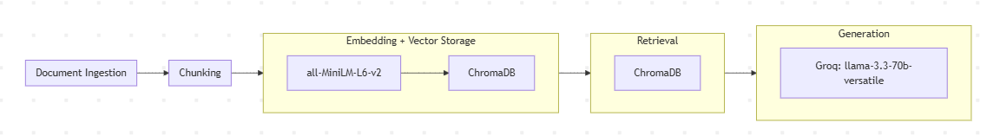

# Project 1 Planning: The Unofficial Guide

> Write this document before you write any pipeline code.
> Your spec and architecture diagram are what you'll use to direct AI tools (Claude, Copilot, etc.) to generate your implementation — the more specific they are, the more useful the generated code will be.
> Update the Retrieval Approach and Chunking Strategy sections if you change your approach during implementation.
> Update this file before starting any stretch features.

---

## Domain

<!-- What domain did you choose? Why is this knowledge valuable and hard to find through official channels? -->
The domain I chose is on the K-Pop group NewJeans, with many talking points such as who they are, what they achieved, commentary on their music style and influence, and also their legal dispute that halted their group activities. Official channels ran by the group's company only acts as promotional sources and presents only one viewpoint. The sources I've gathered combines articles from journalists and commentary from fans that provide information that official sources wouldn't care to cover such as music analysis, group history, and current legal disputes.
---

## Documents

<!-- List your specific sources: URLs, subreddit names, forum threads, or file descriptions.
     Aim for at least 10 sources that together cover different subtopics or perspectives within your domain. -->

| # | Source | Description | URL or location |
|---|--------|-------------|-----------------|
| 1 | Kprofiles | Profile and fun facts about each NewJeans member | https://kprofiles.com/newjeans-members-profile/ |
| 2 | Wikipedia — NewJeans | General overview of the group's formation and history | https://en.wikipedia.org/wiki/NewJeans |
| 3 | Wikipedia — NewJeans Discography | Complete list of EPs, singles, and single albums with release dates and chart positions | https://en.wikipedia.org/wiki/NewJeans_discography |
| 4 | Billboard — Chart Rise Explainer | Covers NewJeans' Billboard Hot 100 entries, Billboard 200 #1 album, and Group of the Year award | https://www.billboard.com/music/chart-beat/billboard-explains-newjeans-rise-on-charts-1235611739/ |
| 5 | Billboard — Gods/League of Legends Interview | Article covering their League of Legends Worlds 2023 anthem collaboration | https://www.billboard.com/music/pop/newjeans-interview-gods-league-of-legends-world-championships-2023-exclusive-1235519282/ |
| 6 | Harvard Crimson — Attention Review | Analysis of NewJeans' debut sound, Y2K aesthetic, and "newtro" cultural concept | https://www.thecrimson.com/article/2022/9/20/newjeans-kpop-girlgroup-hybe-attention-debut-single/ |
| 7 | Mixmag Asia — K-Pop Genre Evolution | Genre deep-dive into how NewJeans incorporated UK garage, Baltimore club, and Jersey club into K-pop | https://mixmag.asia/feature/new-jeans-k-pop-evolution-aesthetic-dance-music-genres-breaks-bass |
| 8 | Koreaboo — Records Shattered | Breakdown of Spotify, Melon, and Billboard records broken in their debut year | https://www.koreaboo.com/lists/records-newjeans-shattered-in-first-year/ |
| 9 | Euronews — Guinness World Record | Covers NewJeans becoming the fastest K-pop act to hit 1 billion Spotify streams | https://www.euronews.com/culture/2023/05/09/newjeans-break-guinness-world-record-to-become-fastest-k-pop-act-to-hit-1-billion-streams- |
| 10 | Koreaboo — Brand Deals | Overview of 15+ NewJeans brand partnerships including Coca-Cola, Nike, Levi's, McDonald's, and Apple | https://www.koreaboo.com/lists/newjeans-brand-ambassador-deals-global-impact-style-adaptability/ |
| 11 | CNBC — Contract Ruling | Covers the October 2025 court ruling upholding NewJeans' contracts with ADOR through 2029 | https://www.cnbc.com/2025/10/30/newjeans-contract-ruling-valid-hybe-gains-almost-630-million-.html |
| 12 | Korea Herald — Legal Aftermath | Covers NewJeans' legal dispute and battles extending into 2026 | https://www.koreaherald.com/article/10640428 |
| 13 | Korea Times — Danielle Exit | Dedicated coverage of Danielle's contract termination and each member's return status as of December 2025 | https://www.koreatimes.co.kr/entertainment/k-pop/20251229/newjeans-full-group-return-derailed-as-ador-ends-danielles-contract |
| 14 | K-Crush — Complete Guide | Comprehensive guide covering the group's music, members, legal summary, and 2026 status | https://k-crush.com/newjeans-complete-guide-2026/ |
| 15 | K-Crush — Member Status Timeline | Month-by-month tracker of each member's return or departure status, last updated May 2026 | https://k-crush.com/newjeans-timeline-2026-updates/ |

---

## Chunking Strategy

<!-- How will you split documents into chunks?
     State your chunk size (in tokens or characters), overlap size, and explain why those
     numbers fit the structure of your documents.
     A review-heavy corpus warrants different chunking than a long FAQ. -->
Semantic chunking
**Chunk size:**
250 tokens
**Overlap:**
50 tokens

**Reasoning:**
Most of the sources I use are articles or multiple paragraphs rather than pages that have uniform structure. I do have Wikipedia and similar sources, but not all of my sources have clearly defined structure, and semantic chunking can still work with structure to retain contextual meaning. Given that the embedding model I'm using has a 256 token context length, I think 250 tokens is a reasonable chunk size to maintain a balance between precision and contextual meaning, given that some sources are quite lengthy. A 50 token overlap helps retain a bit of context from the previous chunk without repeating too much information since it is only around a 15% portion.
---

## Retrieval Approach

<!-- Which embedding model are you using (e.g., all-MiniLM-L6-v2 via sentence-transformers)?
     How many chunks will you retrieve per query (top-k)?
     If you were deploying this for real users and cost wasn't a constraint, what tradeoffs
     would you weigh in choosing a different embedding model — context length, multilingual
     support, accuracy on domain-specific text, latency? -->

**Embedding model:**
all-MiniLM-L6-v2 via sentence-transformers
**Top-k:**
4
**Production tradeoff reflection:**
If this was deployed for production and real users, a I'd prioritize accuracy on domain-specific text and latency over context length and multilingual support. The sources I use are specifically English and don't have much non-English terms (possibly none at all). It would help expand the userbase to more languages, but I wouldn't say its more important to the user experience of getting highly relevant and quality responses based on the domain quickly. I don't think context length needs to be extended immensely since the chunk sizes for my sources seem balanced already.

---

## Evaluation Plan

<!-- List your 5 test questions with their expected correct answers.
     Questions should be specific enough that you can judge whether the system's response
     is right or wrong. "What are good dining halls?" is too vague.
     "What do students say about wait times at [dining hall name] during lunch?" is testable. -->

| # | Question | Expected answer |
|---|----------|-----------------|
| 1 | Who are the members of NewJeans? | Minji, Hanni, Danielle, Haerin, and Hyein|
| 2 | What label are NewJeans signed under? | ADOR, a sub-label of HYBE |
| 3 | What was the first release EP NewJeans released? | "New Jeans" |
| 4 | What were NewJeans' most recent music release? | The album "Supernatural" |
| 5 | Who's contract was terminated in NewJeans? | Danielle |

---

## Anticipated Challenges

<!-- What could go wrong? Name at least two specific risks with reasoning.
     Consider: noisy or inconsistent documents, missing source attribution, off-topic
     retrieval, chunks that split key information across boundaries. -->

1. Despite using a reasonable chunking size, chunks might still be small and may split between key information across boundaries, especially for my sources that are more lengthy. Ideally, I would like to try 350 token chunk size, but the embedding model's maximum context length is 256 tokens. Embedding model may miscalculate similarity/contextual meaning of text as well and split incorrectly. 

2. Off-topic retrieval may happen depending on the words used in the query and how my sources were chunked. It's possible for a chunk to match to a query better than the "correct" or most relevant chunk given that it will all be based and calculated by the embedding model. For example, maybe a chunk uses a specific word that was mentioned in the query, but the more relevant chunk doesn't and is ranked lower in retrieval.

---

## Architecture

<!-- Draw a diagram of your pipeline showing the five stages:
     Document Ingestion → Chunking → Embedding + Vector Store → Retrieval → Generation
     Label each stage with the tool or library you're using.
     You can use ASCII art, a Mermaid diagram, or embed a sketch as an image.
     You'll use this diagram as context when prompting AI tools to implement each stage. -->

---

## AI Tool Plan

<!-- For each part of the pipeline below, describe:
     - Which AI tool you plan to use (Claude, Copilot, ChatGPT, etc.)
     - What you'll give it as input (which sections of this planning.md, which requirements)
     - What you expect it to produce
     - How you'll verify the output matches your spec

     "I'll use AI to help me code" is not a plan.
     "I'll give Claude my Chunking Strategy section and ask it to implement chunk_text()
     with my specified chunk size and overlap" is a plan. -->

All AI-assisted coding I use will be with CodePath's provided subscription for Claude Code.

For my ingestion and chunking part, I'll give Claude my Documents and Chunking Strategy section and also Architecture Diagram, asking it to implement a chunk_text() function with my proposed chunk size and overlap, taking in source files (most likely .txt instead of web scraping) and return a list of chunks represented in a dictionary that holds metadata such as "text", "source", and "chunk_id". I will verify the result by printing the amount of chunks and details of 1-2 example chunks that were returned.

For embedding and storage, I'll give Claude my Architecture Diagram, asking it to implement a embed_and_store() function that uses my specified embedding model and ChromaDB to embed the list of chunks and store into the vector database while maintaining the metadata. I will verify the result by printing the length of the vector database to ensure it has all the chunks stored and details of 1 stored chunk.

For retrieval, I'll give Claude my Retrieval Approach section and the Architecture Diagram, asking it to implement a retrieve() function that takes in a query and my top-k to return a list of the k amount of most relevant chunks to the query that are stored in the vector database. To verify, I'll print the amount of chunks retrieved and their metadata to check if they were relevant to the query such as checking similarity/distance score.

For generation, I'll give Claude my Architecture Diagram and ask it to implement a generate_response() function that takes in a query and a list of retrieved chunks and generates a grounded response to the query using the retrieved chunks. It will create and prompt Groq for a grounded response and will include a system prompt that provides grounding instructions and metadata-prefixed chunks for context. It will only respond if the retrieved chunks it receives are very relevant to the query, possibly a threshold of 85% confidence. Each answer must cite the source it got it from (using the metadata of the chunks). If it isn't confident in answering, say so.

**Milestone 3 — Ingestion and chunking:**

**Milestone 4 — Embedding and retrieval:**

**Milestone 5 — Generation and interface:**
